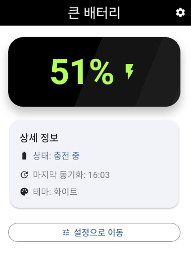
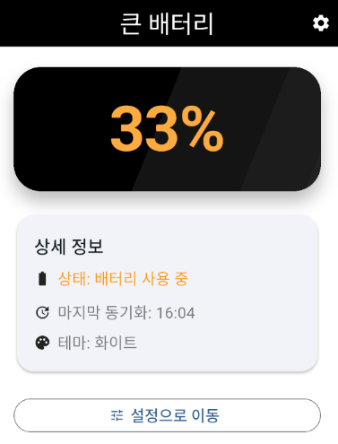
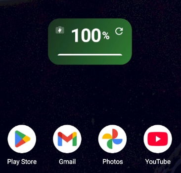
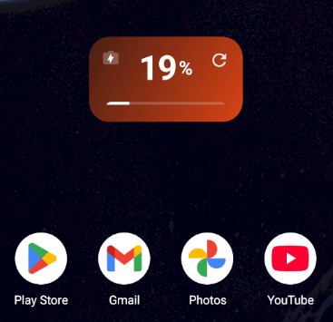

# Big Battery Widget App

> Flutter 기반으로 제작된 접근성 친화 배터리 모니터링 앱과 안드로이드 홈 위젯 샘플입니다. 실시간 배터리 스트림, 저전력 알림, 사용자 설정 영속화를 통해 실제 디바이스의 배터리 상태를 직관적으로 확인할 수 있습니다.

## 📷 Capture Swipe

|  |  |
| --- | --- |
|  |  |

> 이미지는 `docs/images/` 폴더에서 관리하며, 새 캡처를 촬영하면 동일한 파일명을 교체하거나 표를 확장하면 됩니다.

---

## 프로젝트 소개

- **큰 배터리 카드**: `BatteryWidget`이 퍼센트와 충전 상태를 크게 보여 주고 남은 용량 구간에 맞춰 색을 변경합니다.
- **실시간 스트림**: `BatteryProvider`가 `battery_plus` 스트림과 네이티브 위젯 브로드캐스트를 모두 구독해 앱/홈 위젯을 동시에 갱신합니다.
- **저전력 알림**: 잔량 20% 이하 & 미충전 시 `flutter_local_notifications`로 경고 알림을 발송하고 Android 13+ 권한 요청을 처리합니다.
- **간결한 설정**: 글꼴 크기, 라이트/다크 테마, 저전력 알림 여부만 남겨 사용성이 단순해졌으며 모든 값은 `shared_preferences`에 저장됩니다.
- **안드로이드 홈 위젯**: `BatteryStatusWidget`이 충전 이벤트 브로드캐스트와 위젯 내 새로고침 버튼으로 앱 실행 여부와 관계없이 상태를 반영합니다.

## 현재 버전 하이라이트

- 앱 홈 상세 카드에서 배터리 상태/동기화 시각/현재 테마를 한눈에 확인하고, 위젯과 동일한 색상 체계를 적용했습니다.
- 홈 위젯은 좌상단 충전 배지, 우상단 새로고침 버튼으로 고정 배치되어 UX가 단순합니다.
- 고대비 테마는 기본 UI 팔레트로 통합해 별도 토글이 필요 없으며, 라이트/다크 전환만 유지합니다.

## 주의사항

1. **Flutter SDK 경로**  
   - 현재 WSL에서는 `/mnt/d/.../flutter`가 PATH 상단에 있어 권한 문제가 자주 발생합니다.  
     ```bash
     export PATH="/mnt/c/smlee/02.Project/app/big_battery_widget_app/.flutter-sdk/bin:$PATH"
     hash -r
     flutter doctor -v
     ```
   - 영구 적용이 필요하면 `~/.bashrc` 또는 Windows Terminal 프로필에 동일한 PATH를 설정하세요.

2. **WSL ↔ Windows 권한**  
   - Windows 파티션(예: `/mnt/d`)에서 Flutter를 실행하면 `bin/cache` 갱신 시 `Permission denied`가 발생합니다. WSL 내부 경로로 복사하여 사용하거나 Windows에서만 Flutter 명령을 실행하세요.

3. **네트워크 제한**  
   - `flutter build apk --release`가 `storage.googleapis.com`에 접근하지 못하면 엔진 아티팩트를 내려받지 못해 실패합니다. 방화벽/프록시를 확인하고 재시도하세요.

4. **알림 권한**  
   - Android 13 이상에서는 `POST_NOTIFICATIONS` 권한이 필요합니다. 앱 최초 실행 시 권한 안내가 표시되지 않으면 `설정 > 애플리케이션 > 알림`에서 수동으로 허용해야 알림이 동작합니다.

## 폴더 구조

```text
lib/
 ├── app.dart                   # Provider + MaterialApp 부트스트랩
 ├── main.dart                  # 서비스 초기화 엔트리포인트
 ├── providers/battery_provider.dart
 ├── screens/
 │    ├── home_screen.dart      # 배터리 대시보드
 │    └── settings_screen.dart  # 글꼴/테마/알림 설정
 ├── services/
 │    ├── battery_service.dart
 │    └── notification_service.dart
 ├── widgets/
 │    ├── battery_display.dart
 │    └── battery_widget.dart
 └── utils/theme.dart
test/
 └── widgets/battery_display_test.dart
android/app/src/main/kotlin/com/example/big_battery_widget_app/
 ├── BatteryStatusWidget.kt         # AppWidgetProvider
 ├── BatterySnapshotProvider.kt     # 네이티브 배터리 측정
 └── MainActivity.kt                # EventChannel + Flutter 엔진
```

## 안드로이드 홈 위젯 메모

- `android/app/src/main/res/xml/battery_widget_info.xml`: 2x1 기본 크기, 가로 리사이즈 허용.
- `BatteryWidgetUpdater`: 배터리 브로드캐스트를 받아 위젯 전면을 다시 그리며 배터리 잔량에 따라 `widget_bg_high/medium/low` 배경을 적용합니다.
- `BatteryStatusWidget`은 충전 브로드캐스트를 런타임으로 등록하고, 위젯 내 새로고침 버튼을 통해 수동 갱신을 지원합니다.

### 설치 및 확인 절차
1. `flutter install` 또는 `flutter run -d <deviceId>`로 기기에 앱을 설치합니다.
2. 홈 화면에서 “큰 배터리 위젯”을 추가하고 필요하면 가로 크기를 확장합니다.
3. 충전 케이블 연결/분리 혹은 배터리 잔량을 변화시키면 위젯이 즉시 새 데이터를 표시하고 배경색이 구간별로 바뀌는지 확인합니다.

## 개발/실행 가이드

| 작업 | 명령 |
| --- | --- |
| 의존성 설치 | `flutter pub get` |
| 정적 분석 | `flutter analyze` |
| 위젯/단위 테스트 | `flutter test` |
| 웹 실행 (예: Chrome) | `flutter run -d chrome` |
| 디바이스 목록 | `flutter devices` |
| 릴리스 APK | `flutter build apk --release` |

필요 시 `flutter clean && flutter pub get`으로 캐시를 초기화한 뒤 다시 실행하세요. Web 빌드 렌더러가 필요하면 `--web-renderer html` 또는 `--web-renderer canvaskit`을 추가할 수 있습니다.

## 트러블슈팅 체크리스트

- Flutter 명령이 D: 드라이브 SDK를 가리킨다면 PATH를 수정하거나 `.flutter-sdk/bin`을 맨 앞에 둡니다.
- `flutter doctor -v`에서 Android SDK가 감지되지 않으면 `flutter config --android-sdk <path>` 또는 Android Studio 설치가 필요합니다.
- 네트워크 차단 환경에서는 필요한 ZIP을 미리 다운로드 후 `.flutter-sdk/bin/cache`에 수동 배치해 작업을 계속할 수 있습니다.

---

문의나 개선 제안은 이 레포지토리의 이슈 트래커에 등록해 주세요. PR 시 `flutter analyze`, `flutter test` 결과를 함께 공유하면 리뷰 속도가 빨라집니다.
